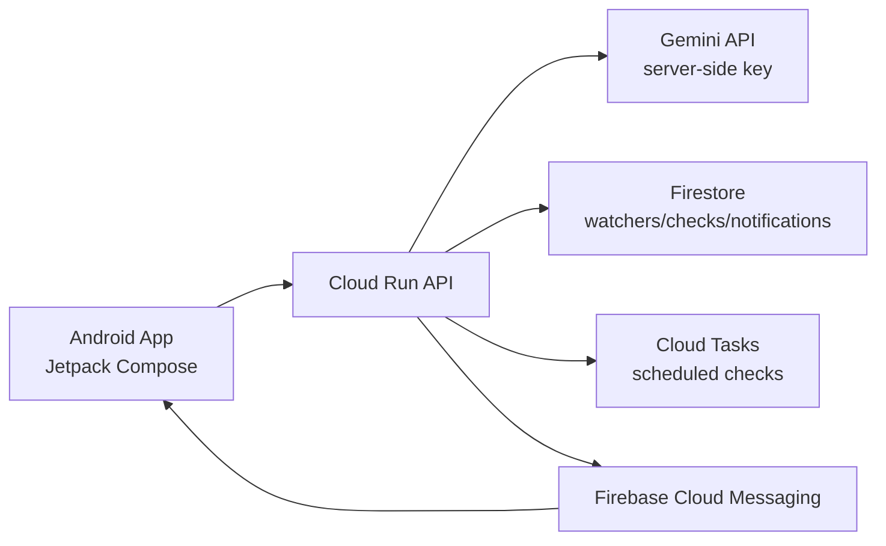

# Watch-ER

Android-first web watching and reminding app. Watch-ER lets a user describe what they are waiting for, turns that intent into a monitoring strategy, checks public web/API/search sources in the cloud, and only notifies when the condition is likely true.

## What Is Implemented

- `android/`: Android Studio-ready Kotlin + Jetpack Compose scaffold with a Manus-inspired productivity UI.
- `backend/`: Cloud Run-oriented TypeScript service skeleton for watcher creation, checks, Gemini strategy/synthesis, scheduling, and notifications.
- `docs/api.md`: Android/backend contract and data shapes.

## Architecture



## Local Setup

### Android

Open `android/` in Android Studio. Configure the backend URL in:

`android/app/src/main/java/com/watch_er/core/WatchErConfig.kt`

Firebase setup is intentionally not committed. Add your own `google-services.json` when you create a Firebase project.

### Backend

The backend is written for Cloud Run. Copy the example env file:

```bash
cp backend/.env.example backend/.env
```

Set:

- `GEMINI_API_KEY`
- `FIREBASE_PROJECT_ID`
- `ANDROID_PACKAGE_NAME`
- `PUBLIC_BASE_URL`

Then install and run from `backend/`:

```bash
npm install
npm run dev
```

This environment currently does not have Java, Gradle, Python, or a usable Node runtime available, so build/test execution could not be performed here.

## Product Defaults

- One-shot watchers by default.
- 90% confidence threshold.
- Public URL/API/search sources only.
- Gemini API keys stay on the backend.
- Android app talks only to the backend and Firebase services.
